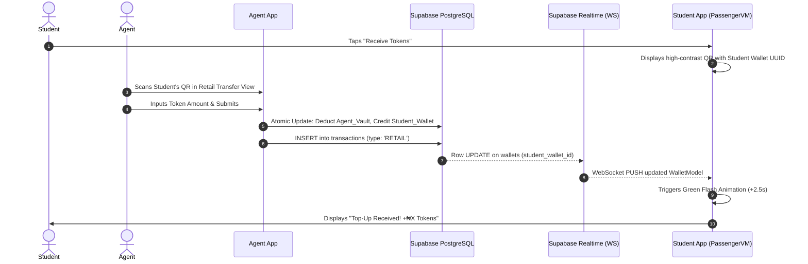
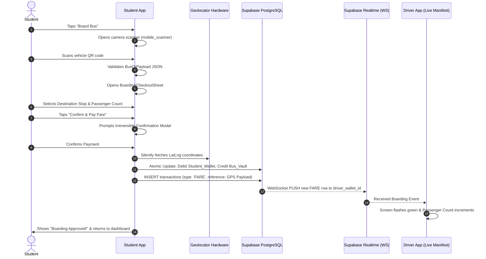

# Passenger Application Guide — QR Fare Transit

> **Audience**: Developers, System Integrators, Academic Evaluators  
> **Tech Stack**: Flutter 3.29 · Dart 3.7 · Riverpod 2.6 · GoRouter 14 · Supabase SDK · Mobile Scanner · Geolocator · QR Flutter

This guide documents the architecture, user journeys, data contracts, and implementation details for the **Passenger (Student)** module of the QR Fare Transit mobile ecosystem.

---

## 1. Overview & Objective

The Passenger Application provides university students with a self-service transit wallet. It completes the ecosystem loop by connecting students to campus **Ticket Agents** (who vend tokens) and **Transit Drivers** (who accept fare payments).

### Key Features
* 💳 **Live Digital Transit Wallet**: Displays token credits with a persistent WebSocket listener for instantaneous balance updates.
* 🟢 **Instant Top-Up Visual Signal**: Full-screen emerald green flash and notification banner triggered the moment an Agent transfers funds to the student.
* 📲 **Personal Receiving QR Code**: High-contrast QR code rendering the student's Wallet UUID for Agent scanning.
* 🚌 **"Scan-to-Pay" Boarding Scanner**: High-performance camera scanner that validates the vehicle's mounted JSON QR code.
* 📍 **Silent Geolocation Payload Assembly**: Automatically captures high-accuracy GPS coordinates (`latitude`, `longitude`) upon bus scanning.
* 🏷️ **Distance-Based Fare Pricing**: Stage-based campus stop pricing enforcing a **strict minimum of 100 tokens** per passenger.
* 👥 **Multi-Passenger Checkout**: Quantity counter (`1..10`) allowing students to pay for multiple companions in a single atomic transaction.
* ⚠️ **Irreversible Transaction Guard**: Pop-up modal ensuring confirmation before funds leave the wallet.
* 🗺️ **Campus Transit Map**: Static visual map outlining shuttle routes, stops, and fare tiers.
* 📜 **Filterable Activity Ledger**: Categorized history distinguishing bus boardings (`FARE`) from agent top-ups (`RETAIL`).

---

## 2. Architecture & File Structure

The Passenger module adheres strictly to the **MVVM (Model-View-ViewModel)** architectural pattern decoupled via **Riverpod**:

```
lib/
├── core/
│   ├── constants/
│   │   ├── app_routes.dart                   # Named routes (/passenger/*)
│   │   ├── app_strings.dart                  # User-facing copy & warning dialogs
│   │   └── transit_pricing.dart              # Campus stops, stages & minimum 100 token rules
│   ├── router/
│   │   ├── app_router.dart                   # GoRoute declarations for Passenger views
│   │   └── router_notifier.dart              # Role guard redirecting UserRole.student
│   └── theme/
│       └── app_colors.dart                   # Sky/Cyan color tokens & Passenger gradients
├── models/
│   ├── bus_qr_payload.dart                   # JSON parser for vehicle QR codes
│   ├── transaction_model.dart                # TransactionModel with TransactionType.retail & .fare
│   └── wallet_model.dart                     # WalletModel with copyWith helper
├── repositories/
│   ├── transaction_repository.dart           # getStudentTransactions() ledger query
│   └── wallet_repository.dart                # watchWallet() Realtime WebSocket stream
├── viewmodels/
│   └── passenger_dashboard_viewmodel.dart    # Riverpod Notifier managing wallet, checkout & boarding
└── views/
    └── passenger/
        ├── passenger_dashboard_view.dart     # Digital wallet UI + animated green flash + receive modal
        ├── passenger_scanner_view.dart       # Camera scanner validating bus JSON QR
        ├── boarding_checkout_sheet.dart      # Checkout bottom sheet + irreversible alert
        ├── passenger_map_view.dart           # Campus transit route stops & pricing
        └── passenger_history_view.dart       # Filterable rides & top-up ledger
```

---

## 3. Core Workflows & Data Flows

### Workflow A: Receiving Tokens from an Agent (Retail Vending)



---

### Workflow B: Scan-to-Pay Boarding & Driver Manifest Trigger



---

## 4. Data Contracts & Schemas

### 1. Vehicle QR Code JSON Schema (`BusQrPayload`)
Vehicles have a static QR code mounted in passenger compartments containing:

```json
{
  "type": "BUS_BOARDING",
  "vehicle_id": "BUS-001",
  "route_name": "Campus Main Loop",
  "bus_vault_id": "3fa85f64-5717-4562-b3fc-2c963f66afa6",
  "base_fare": 100
}
```

* Parsing implementation: [`BusQrPayload.tryParse(rawString)`](file:///C:/Users/User/Final%20year%20project/driver_agent_fyp/lib/models/bus_qr_payload.dart).
* Rejection criteria: Non-JSON strings, missing keys, or `type != "BUS_BOARDING"`.

### 2. Geolocation Payload Reference
When a fare payment is submitted, the device coordinates and transit metadata are encoded into the `reference` column of the `transactions` table:

```json
{
  "vehicle_id": "BUS-001",
  "route": "Campus Main Loop",
  "destination": "University Central Library",
  "destination_code": "STOP-LIB",
  "passengers": 2,
  "fare_paid": 280.0,
  "gps": {
    "latitude": 6.5244,
    "longitude": 3.3792
  },
  "timestamp": "2026-09-14T14:30:00.000Z"
}
```

### 3. Campus Transit Stops & Minimum Fare Rules (`TransitPricing`)
Enforced in [`transit_pricing.dart`](file:///C:/Users/User/Final%20year%20project/driver_agent_fyp/lib/core/constants/transit_pricing.dart):

| Stop ID | Destination Name | Base Fare (Tokens) | Minimum Enforced |
|---|---|---|---|
| `STOP-GATE` | Campus Main Gate | 100 | ✅ Yes (100 tokens) |
| `STOP-ADMIN` | Senate & Student Affairs | 100 | ✅ Yes (100 tokens) |
| `STOP-FACULTY` | Faculty of Science & Tech | 120 | ✅ Yes (100 tokens) |
| `STOP-LIB` | University Central Library | 140 | ✅ Yes (100 tokens) |
| `STOP-SPORTS` | Sports Complex & Clinic | 160 | ✅ Yes (100 tokens) |
| `STOP-HOSTEL` | Student Hostels (Halls 1-6) | 180 | ✅ Yes (100 tokens) |
| `STOP-PG` | Postgraduate Village | 200 | ✅ Yes (100 tokens) |

**Formula**:
$$\text{Total Fare} = \max(\text{Stop Base Fare}, 100) \times \text{Passenger Count}$$

---

## 5. State Management (`PassengerDashboardViewModel`)

Defined in [`passenger_dashboard_viewmodel.dart`](file:///C:/Users/User/Final%20year%20project/driver_agent_fyp/lib/viewmodels/passenger_dashboard_viewmodel.dart) as a Riverpod `Notifier<PassengerDashboardState>`.

### State Properties
```dart
class PassengerDashboardState {
  final bool isLoading;
  final WalletModel? wallet;
  final List<TransactionModel> recentTransactions;
  final String? loadError;

  // Real-time flash trigger
  final bool showTopupFlash;
  final double lastReceivedAmount;

  // Boarding & checkout state
  final TransitStop selectedStop;
  final int passengerCount;
  final bool isBoarding;
  final String? boardingError;
  final String? boardingSuccess;
}
```

### Key Operations
1. **`loadDashboard(UserModel student)`**: Fetches initial wallet balance and transaction history via `getStudentTransactions()`. Spawns `_subscribeToWallet()`.
2. **`_subscribeToWallet(String walletId)`**: Subscribes to Supabase Realtime. If `newBalance > currentBalance`, sets `showTopupFlash = true` and starts a 2.5-second auto-reset timer.
3. **`setDestination(TransitStop stop)`** & **`setPassengerCount(int count)`**: Modifies checkout configuration and re-computes `calculatedFare`.
4. **`processBoarding({required BusQrPayload busPayload})`**:
   * Validates sufficient balance.
   * Acquires GPS via `LocationService.getCurrentPosition()`.
   * Atomically decrements student wallet (`-fare`) and increments bus vault (`+fare`).
   * Logs `TransactionType.fare` with assembled GPS metadata.

---

## 6. User Interface & Views

### 1. Digital Wallet (`PassengerDashboardView`)
* **Live Balance Card**: Styled with Sky/Cyan gradient (`AppColors.passengerGradient`) and NFC icon. Features animated border and drop shadow that glow vivid emerald on incoming top-up.
* **"Board Bus" CTA**: Large, full-width elevated button triggering the camera scanner.
* **"Receive Tokens" Modal**: Bottom sheet rendering a white background `QrImageView` of the student's Wallet UUID, monospace text, and a copy-to-clipboard button.
* **Recent Activity**: Displays recent debit rides (`Icons.directions_bus`) and credit top-ups (`Icons.arrow_downward`).

### 2. Camera Scanner (`PassengerScannerView`)
* Built with `mobile_scanner`.
* Custom reticle target and torch toggle button.
* Rejects non-bus barcodes with an immediate feedback SnackBar.
* On detection of a valid `BusQrPayload`, halts camera stream and displays `BoardingCheckoutSheet`.

### 3. Boarding Checkout (`BoardingCheckoutSheet`)
* Displays bus identifier and route name with verified badge.
* Interactive dropdown for destination selection with live token pricing.
* Passenger counter (`[-] N [+]`) with bounds clamped between 1 and 10.
* Irreversible Confirmation Dialog:
  > *"Are you sure you want to deduct ₦X tokens for N passenger(s) on BUS-XXX? Warning: This transaction is immediate and cannot be reversed."*

### 4. Transit Map (`PassengerMapView`)
* Visual roadmap with timeline indicators for each campus station.
* Displays operating hours (06:30 AM – 10:00 PM) and fleet status indicator.

### 5. Activity Ledger (`PassengerHistoryView`)
* Filter chips: `All Activity`, `Bus Rides`, `Top-Ups`.
* Timestamps formatted as human-readable `YYYY-MM-DD HH:MM:SS`.

---

## 7. Role Isolation & Routing

Integrated into GoRouter via [`router_notifier.dart`](file:///C:/Users/User/Final%20year%20project/driver_agent_fyp/lib/core/router/router_notifier.dart):

```dart
// Route Categories
final bool isGoingToProtectedRoute = destination.startsWith('/agent') ||
    destination.startsWith('/driver') ||
    destination.startsWith('/passenger');

// Redirection Rules
if (user != null && isGoingToAuthScreen) {
  if (user.role == UserRole.agent) {
    return AppRoutes.agentDashboard;
  } else if (user.role == UserRole.student) {
    return AppRoutes.passengerDashboard;  // ← Directs students to /passenger/wallet
  } else {
    return AppRoutes.driverDashboard;
  }
}
```

---

## 8. Verification & Unit Testing

The test suite is located in [`test/viewmodels/passenger_dashboard_viewmodel_test.dart`](file:///C:/Users/User/Final%20year%20project/driver_agent_fyp/test/viewmodels/passenger_dashboard_viewmodel_test.dart).

### How to Run Tests
```bash
# Run all unit and viewmodel tests
flutter test

# Run only the passenger test suite
flutter test test/viewmodels/passenger_dashboard_viewmodel_test.dart

# Validate static analysis
flutter analyze
```

### Test Coverage Summary
* ✅ `loadDashboard` initializes balance and empty ledger state.
* ✅ Minimum 100 token constraint validation and passenger scaling ($100 \times N$).
* ✅ JSON schema validation (`BusQrPayload.tryParse`) for valid and malformed payloads.
* ✅ Insufficient balance prevention.
* ✅ Double-entry atomic transfer and GPS metadata recording.
